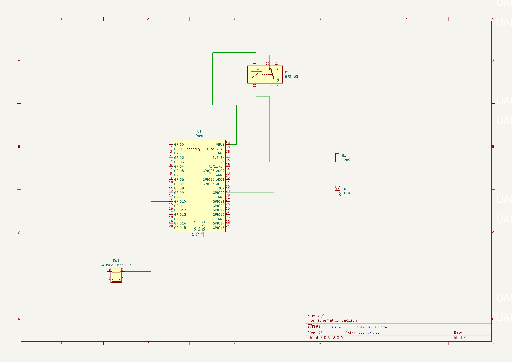
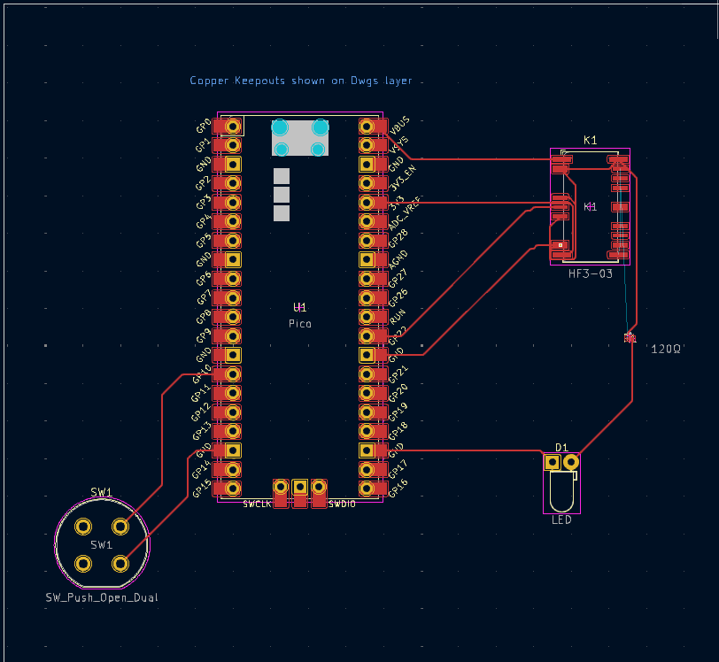
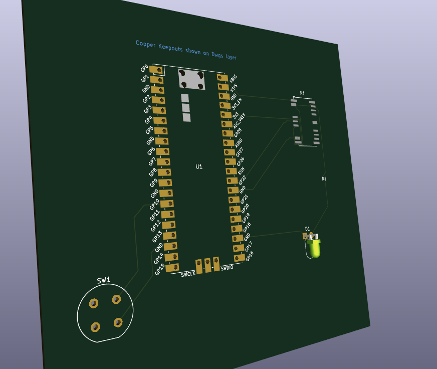

# Atividade Ponderada 6

## Objetivo

O objetivo desta atividade é montar uma placa com o Raspberry Pi Pico e criar um esquemático.

## Atividades Desenvolvidas

Nesta atividade, foram realizados três itens:

1. Esquemático da PCB, conforme visualizado na imagem abaixo:
   

2. Layout da PCB:
   

3. Pasta Gerber que contém os arquivos necessários para que empresas possam fabricar o circuito desenvolvido. Na imagem a seguir, há uma representação da placa:
   

## Estrutura de Pastas

Os arquivos do repositório estão organizados da seguinte forma:

```
├── assets
│   ├── imagens desenvolvidas
├── esquematicos
│   ├── gerber
│   │   ├── arquivos para impressão da placa em gerber
│   ├── esquemáticos do circuito e pcb desenvolvidos com o KiCad
```

## Sobre o circuito 

Este circuito foi inspirado no protótipo desenvolvido com o Raspberry Pi Pico e um relé.

[Circuito em funcionamento](https://youtu.be/Uo2QEAf8ozU)
