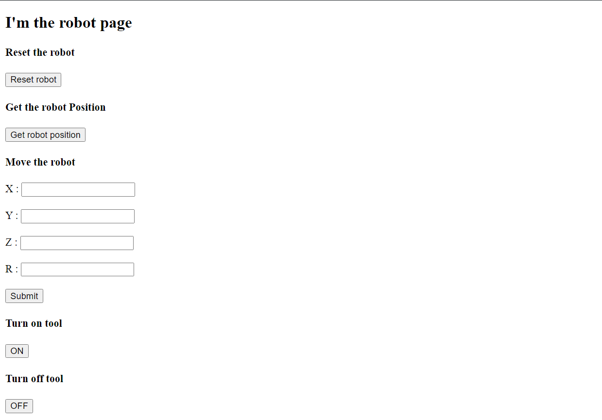
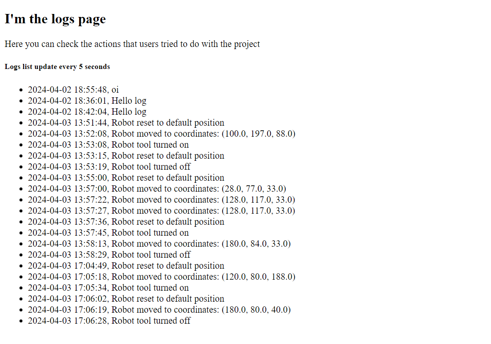
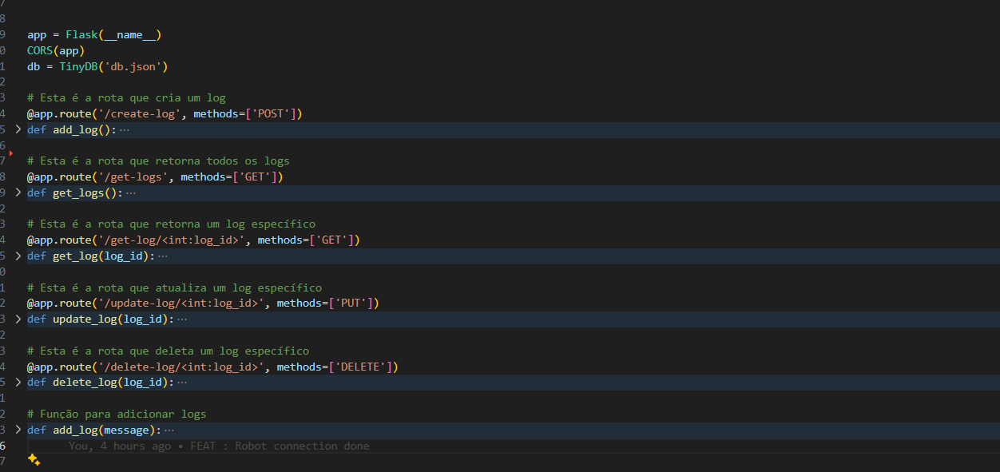
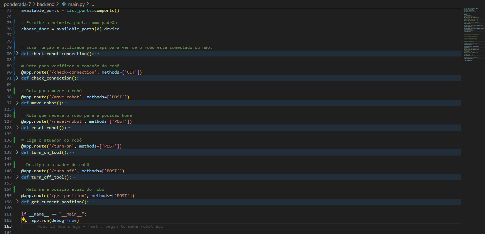
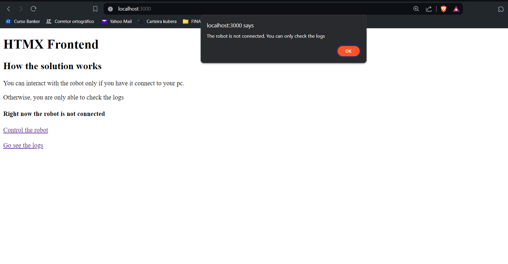

# Atividade Ponderada 7

## Objetivo

O objetivo desta atividade é montar uma interface web com Flask e HTMX. Nessa interface é possível interagir com o robô Magician Lite e também checar os logs das requisições dos usuários. 

## Atividades Desenvolvidas

Nesta atividade, foram realizados três itens:

1. Frontend em HTMX:

Tela home 
   

Tela do robô 
   
   
Tela de logs 
   


2. Backend em Flask:

Rotas do CRUD  
   

Rotas do robô
   

3. Integração entre ambas partes e condicionais de funcionamento:

Checando se há conexão do robô com o computador 
   

## Estrutura de Pastas

Os arquivos do repositório estão organizados da seguinte forma:

```
├── assets
│   ├── imagens desenvolvidas
├── backend
│   ├── api desenvolvida em Flask 
├── frontend
│   ├── telas em HTMX 

```


## Como utilizar 
Para executar o projeto na sua máquina execute os seguintes passos no terminal.

1º Criar um ambiente virtual na pasta backend

<code>python -m venv venv </code>

2º Ativar o ambiente virtual 
 
<code> cd venv </code>

<code> cd Scripts </code>

<code> activate </code>

3º Instalar as dependências 

<code> pip install -r requirements.txt </code>

4º Instalar as dependências do node na pasta frontend 

<code> npm install </code>

5º Rodar o frontend 

<code> npx serve  </code>

Pronto, agora é possível utilizar o projeto. 


## Demonstração 

No vídeo abaixo é possível ver todo o funcionamento do robô. Há a utilização de todas as funções desenvolvidas. 


[](https://www.youtube.com/watch?v=ZBdvX5bcXU8)
